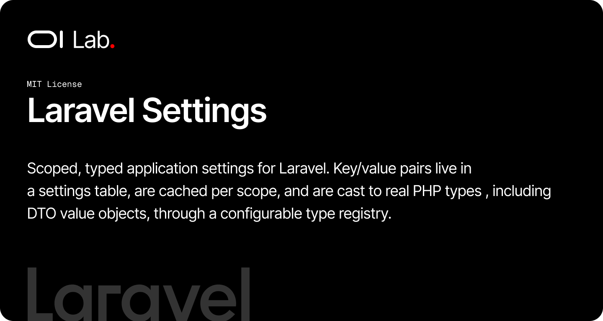

# OI Laravel Settings

[](https://packagist.org/packages/oi-lab/oi-laravel-settings)
[](https://packagist.org/packages/oi-lab/oi-laravel-settings)
[](https://github.com/oi-lab/oi-laravel-settings/actions)
[](LICENSE)

Scoped, typed application settings for Laravel. Key/value pairs live in a
`settings` table, are cached per scope, and are cast to real PHP types —
including [spatie/laravel-data](https://spatie.be/docs/laravel-data) value
objects — through a configurable type registry.

## Features

- Key/value settings persisted in a `settings` table, unique per `[scope, key]`.
- Per-scope resolution with global fallback: `current scope → global → default`,
  driven by a configurable scope resolver or a runtime override.
- Type registry casting the stored value from a sibling `type` column —
  primitives (`string`, `integer`, `float`, `boolean`, `json`) and any
  `spatie/laravel-data` `Data` value object stored as JSON.
- Per-scope caching, busted automatically on every write.
- `Settings` facade, a `setting()` helper, and an injectable `SettingsManager`.
- Definition-driven `SettingsSeeder` base class and a `SettingFactory`.
- Swappable model resolved through `OiLaravelSettings`, never hardcoded.

## How It Works

A setting is a row keyed by `[scope, key]`. `scope` is any `string|int`
identifier (a shop id, a team id, a locale…) or `null` for the global layer.
Reads resolve in order — the current scope, then global, then the caller's
default — so a single global default can be overridden per scope.

The `value` column is stored as a string and cast to its runtime type from the
`type` column via the type registry, so booleans come back as `bool`, JSON as
arrays, and registered `Data` classes as fully-typed value objects.

## Requirements

- PHP 8.2+
- Laravel 11, 12, or 13
- `spatie/laravel-data` ^4.0

## Installation

```bash
composer require oi-lab/oi-laravel-settings
```

### Publish & Migrate

```bash
php artisan migrate
```

Publish the configuration or migration if you need to customise them:

```bash
php artisan vendor:publish --tag=oi-laravel-settings-config
php artisan vendor:publish --tag=oi-laravel-settings-migrations
```

## Configuration

`config/oi-laravel-settings.php` controls the table, model, scope resolver,
cache and the type registry:

```php
'table' => 'settings',

'models' => [
    'setting' => \OiLab\OiLaravelSettings\Models\Setting::class,
],

'scope_resolver' => null,   // null | Closure | invokable class-string
'default_scope' => null,

'cache' => [
    'enabled' => true,
    'store' => null,        // null = default store
    'prefix' => 'oi-settings',
    'ttl' => null,          // null = forever, seconds otherwise
],

'default_type' => 'string',

'types' => [
    'string' => 'string',
    'integer' => 'integer',
    'float' => 'float',
    'boolean' => 'boolean',
    'json' => 'json',
    'mail' => \OiLab\OiLaravelSettings\Data\MailContent::class,
],
```

See the [configuration reference](docs/configuration/configuration.md).

## Usage

### Reading & writing

```php
use OiLab\OiLaravelSettings\Facades\Settings;

Settings::set('SITE_ONLINE', true, type: 'boolean', label: 'Site online');
Settings::get('SITE_ONLINE');            // true
Settings::has('SITE_ONLINE');            // true
Settings::all();                         // merged global + current scope
Settings::delete('SITE_ONLINE');

// Helper
setting('SITE_ONLINE', false);
setting(['THEME' => 'dark']);
```

### Scopes

Every setting belongs to an optional `scope` (`null` = global). Reads resolve
`current scope → global → default`.

```php
Settings::set('THEME', 'dark', scope: null);      // global default
Settings::set('THEME', 'light', scope: 'shop-2'); // override
Settings::get('THEME', scope: 'shop-9');          // 'dark' (fallback)

// Resolve the current scope (e.g. from the active shop/tenant):
Settings::resolveScopeUsing(fn () => app('current_shop_id'));
```

### Typed value objects

Register a `Spatie\LaravelData\Data` class under a type key and it is cast
automatically to/from JSON:

```php
// config/oi-laravel-settings.php
'types' => [
    'mail' => \OiLab\OiLaravelSettings\Data\MailContent::class,
    'address' => \App\Data\AddressData::class,
],

use OiLab\OiLaravelSettings\Data\MailContent;

Settings::set('WELCOME_MAIL', new MailContent(subject: 'Hi'), type: 'mail');
Settings::get('WELCOME_MAIL'); // MailContent instance
```

### Seeding

```php
use OiLab\OiLaravelSettings\Seeders\SettingsSeeder;

class AppSettingsSeeder extends SettingsSeeder
{
    protected function definitions(): array
    {
        return [
            ['key' => 'SITE_ONLINE', 'value' => true, 'type' => 'boolean'],
            ['key' => 'THEME', 'value' => 'light', 'scope' => 'shop-2'],
        ];
    }
}
```

## Customizing the Model

The model is resolved through `OiLaravelSettings::settingModel()`, so you can
point `config('oi-laravel-settings.models.setting')` at a subclass to add
relations or behaviour. See [Custom model](docs/advanced/custom-model.md).

## AI Assistant Skills

The package ships an `oilab-laravel-settings` skill. Install it into a host app:

```bash
php artisan oi:install-ai-skill
```

## Testing

```bash
composer test
```

## Contributing

Contributions are welcome! Please feel free to submit a Pull Request.

When contributing:
1. Write tests for new features
2. Ensure all tests pass: `vendor/bin/pest`
3. Follow existing code style
4. Update documentation as needed

## License

The MIT License (MIT). Please see the [License File](LICENSE) for more information.

## Credits

**[Olivier Lacombe](https://www.olacombe.com)** - Creator and maintainer

Olivier is a Product & Technology Director based in Montpellier, France, with
over 20 years of experience innovating in UX/UI and emerging technologies. He
specializes in guiding enterprises toward cutting-edge digital solutions,
combining user-centered design with continuous optimization and artificial
intelligence integration.

**Projects & Resources:**
- [OI Dev Docs](https://dev.olacombe.com) - Documentation for all Open Source OI Lab packages
- [OnAI](https://onai.olacombe.com) - Training courses and masterclasses on generative AI for businesses
- [Promptr](https://promptr.olacombe.com) - Prompt engineering Management Platform

## Support

For support, please open an issue on the [GitHub repository](https://github.com/oi-lab/oi-laravel-settings/issues).
