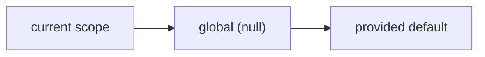

# Scopes

A **scope** is any `string|int|null` identifier — a shop id, a team id, a locale.
`null` is the **global layer**. Every read resolves in this order:



So you store shared defaults globally and override only what differs per scope.

## Explicit scope

Every method accepts a `scope` argument:

```php
Settings::set('THEME', 'dark', scope: null);      // global default
Settings::set('THEME', 'light', scope: 'shop-2'); // override for shop-2

Settings::get('THEME', scope: 'shop-2'); // 'light'
Settings::get('THEME', scope: 'shop-9'); // 'dark'  (falls back to global)
Settings::all(scope: 'shop-2');          // global merged with shop-2
```

## The current scope

When you omit `scope`, the manager resolves the **current scope**. Configure how,
either in config or — preferred when using `config:cache` — at runtime:

```php
// In a service provider (cache-safe, wins over config):
Settings::resolveScopeUsing(fn () => app('current_shop_id'));
```

```php
// config/oi-laravel-settings.php
'scope_resolver' => \App\Settings\CurrentShopScope::class, // invokable class
'default_scope'  => null,                                  // used if no resolver
```

A config closure also works but prevents `config:cache`; use an invokable
class-string or `resolveScopeUsing()` instead.

## Uniqueness

The table is unique on `[scope, key]`, so the same key can exist once per scope
and once globally. Writes go through `firstOrNew`, so `set()` updates in place.
